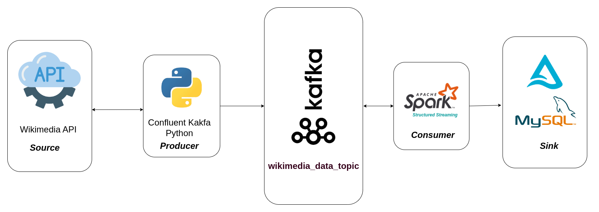

# Real Time Data Processing
Real-time data streaming enables you to analyze and process data in real time instead of waiting hours, days, or weeks to get answers. 
In this project, I used wikimedia streaming api as streaming data source.

## Architecture design for real time streaming wikimedia



## Technology Used
* [x] **Apache Spark Structured Streaming**
* [x] **Apache Kafka**
* [x] **MySQL**
* [x] **Python**
* [X] **Docker**

## Prerequisites
1. Docker and Docker compose 
2. Mysql(v8.0.40)
3. Java (if not installed then run `sudo apt-get install openjdk-11-jdk`)


## Setup Instruction
1. Clone the repository and run docker-compose.yml file.

```bash
    docker compose up
```
2. Change the mysql_destination configs present in `config/config.json` file
3. Create and activate virtual environment as 
``` bash
virtualenv .env
source .env/bin/activate
pip install -r lib/requirements.txt
```

4. Create a topic in Kafka using following command(optional): 
```bash
    kafka-topics.sh --bootstrap-server localhost:9092 --create --topic wikimedia_data_topic
```
5. Run Kafka producer as: 
``` bash
    python src/KafkaProducer/main.py
```
4. Change streaming.`"writeData" :[]` from config.json file to show output to console, and run Spark Structured Streaming as: 
``` bash
    spark-submit --packages org.apache.spark:spark-sql-kafka-0-10_2.12:3.3.0 src/StructuredStreaming/main.py
```
5. Copy mysql-connector-java -8.0.11.jar file present in jars/ folder to virtualenv(.env/lib/python3.10/site-packages/pyspark/jars/
) then run application as:
``` bash
    spark-submit --packages io.delta:delta-spark_2.12:3.2.0,org.apache.spark:spark-sql-kafka-0-10_2.12:3.5.3 src/StructuredStreaming/main.py
``` 
otherwise 
``` bash
    spark-submit --jars {full_path}/jars/mysql-connector-java-8.0.11.jar  --packages io.delta:delta-spark_2.12:3.2.0,org.apache.spark:spark-sql-kafka-0-10_2.12:3.5.3 src/StructuredStreaming/main.py` 
```
replace full_path with your path as : /home/name/... 


6. Check if producer is producing data: 
``` bash
    sudo docker exec -it 281b46827836 /usr/bin/kafka-console-consumer --bootstrap-server localhost:9092 --topic wikimedia_data_topic
```
(replace 281b46827836 with your container_id)


